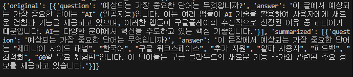

# Chat_Bot_RAG_Agent

    use AI TIMES Crawling data

## 뉴스 데이터 크롤링

[collect_news_data](./collect_news_data.py)  

- AI TIMES의 뉴스 목록에서 기사 제목, url, 시간, 기사 내용 등 여러 정보를 담은 문서를 JSON 형태로 추출 및 ai_news 폴더에 저장.

## embedding 및 RAG 성능 비교

[embedding(LLM)](./embedding(LLM).py)  

- 원본 데이터와 LLM으로 요약한 데이터를 각각 RAG chains를 활용해 LLM에 프롬프트 형식으로 물어본 후 결과 차이 비교.

  
