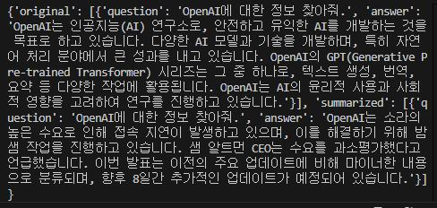
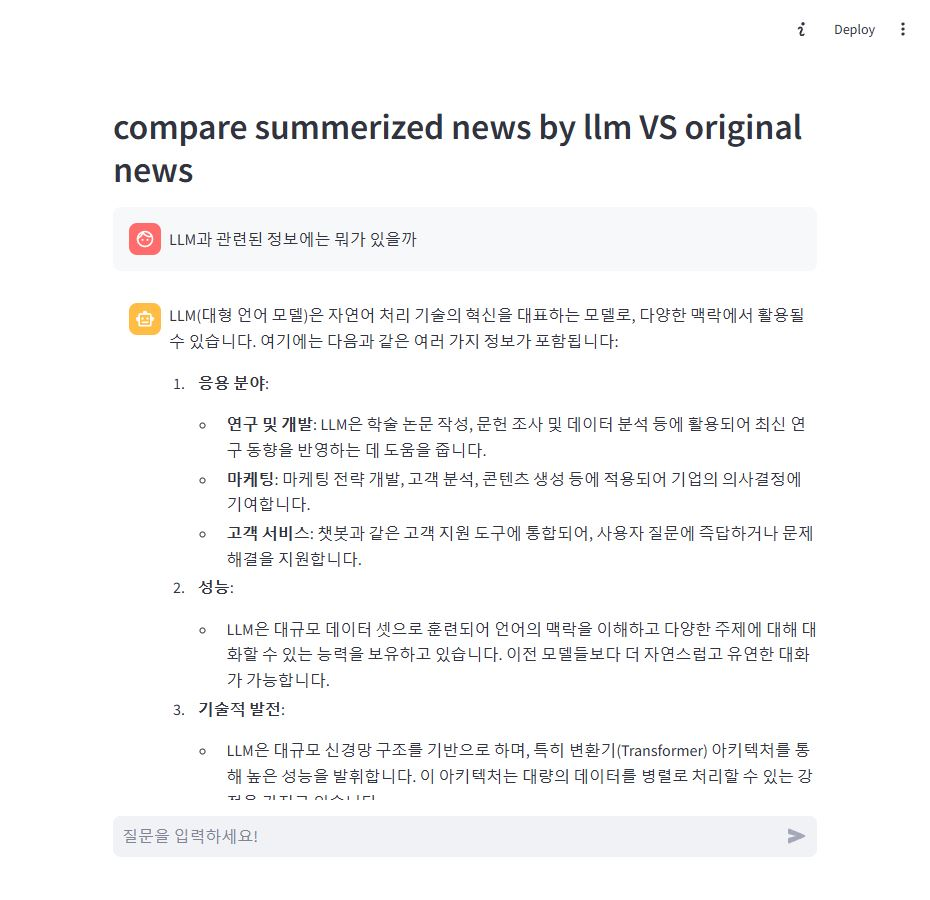
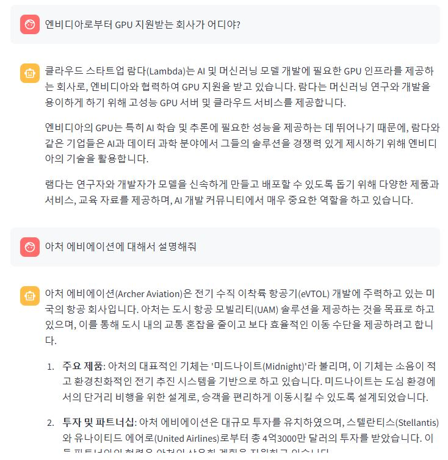

# RAG_Chat_Bot(AI_News)

> used AI TIMES Crawling data

## 실행 방법

1. 패키지 설치 : `pip install -r requirements.txt`

2. 환경 변수 설정 : .env 파일 생성 후에 OpenAI api key 발급받아 `GROUP_API_KEY` 환경 병수 설정

3. 실행 :
    - cmd나 powershell에서 파일 경로로 설정 후,
    - `python collect_news_data.py` 입력(견본 파일 넣어 놔서 생략 가능)
    - `streamlit run chat_bot.py` 입력

## 활용 기술

- BeautifulSoup
- FAISS
- retriever
- langchain

## 구현 과정

### 뉴스 데이터 크롤링

> 24/12/11 완료

구현 코드 : [collect_news_data](./collect_news_data.py)  

- 크롤링한 데이터의 웹페이지 : [AI TIMES](https://www.aitimes.com/news/articleList.html?view_type=sm)

- AI TIMES의 뉴스 목록에서 기사 제목, url, 시간, 기사 내용 등 여러 정보를 담은 문서를 JSON 형태로 추출 및 ai_news 폴더에 저장.

### embedding, Vectorstore 생성 및 RAG LLM 생성

> 24/12/12 완료

구현 코드 : [RAG_LLM](./RAG_LLM.py)  

- 원본 데이터와 LLM으로 요약한 데이터를 각각 RAG chains를 활용해 LLM에 프롬프트 형식으로 물어본 후 결과 차이 비교.

  

### Streamlit으로 챗봇 구현

> 24/12/14 완료

  
  
